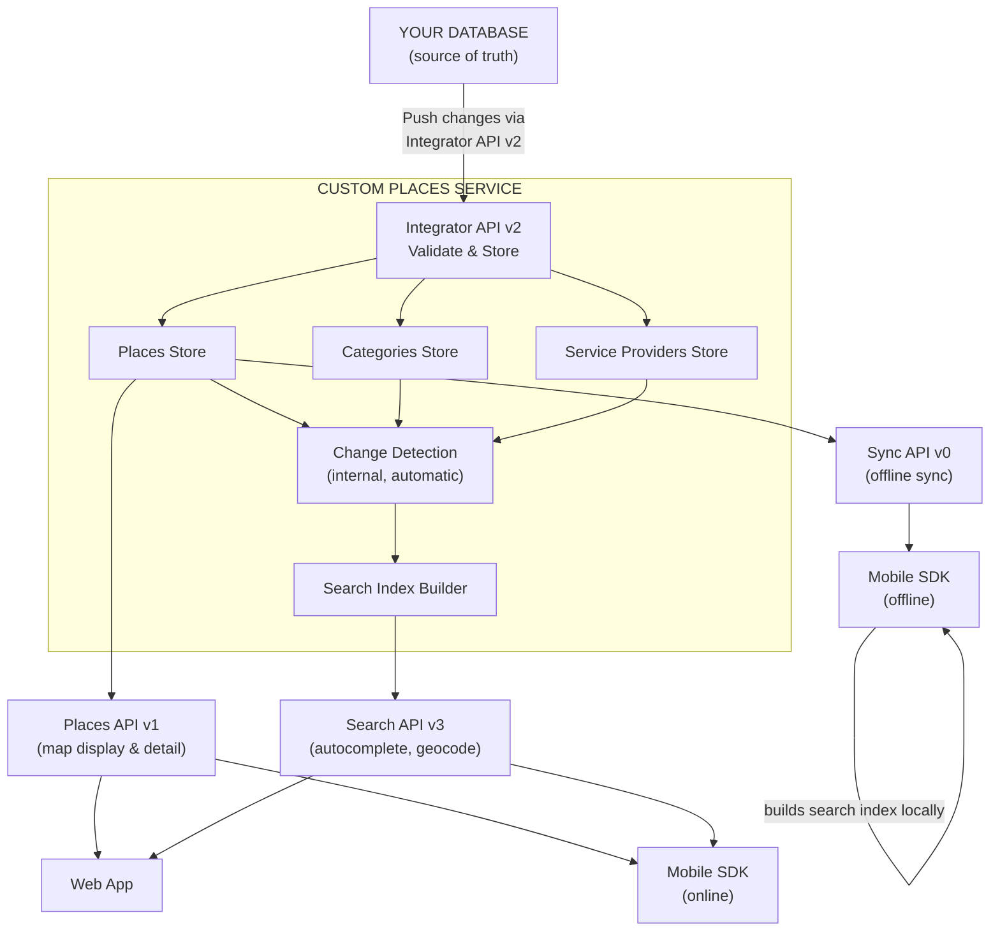
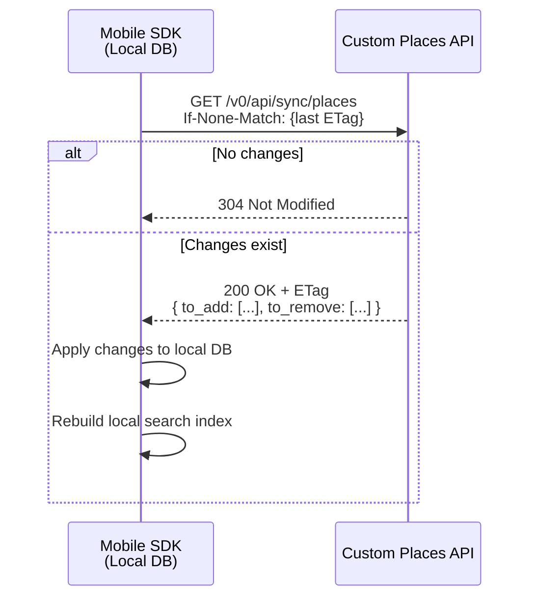
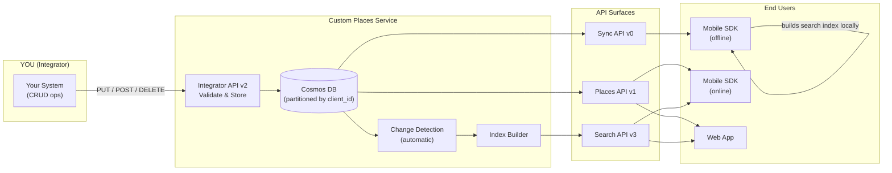

# Custom Places - Integrator Guide

## Overview

Custom Places lets you push your own POI data into Sygic's ecosystem. Once stored, your places become searchable and displayable in Sygic's Mobile SDK and in web applications you build on top of our APIs.

Your database remains the source of truth. This API is a managed data store you keep in sync with your systems - there's no bidirectional sync or merge logic. You push, we store, downstream consumers pick it up.

---

## API Surfaces

| API | Base Path | Role | Who calls it |
|-----|-----------|------|-------------|
| Integrator API v2 | `/v2/api/integrator/` | CRUD for your data | You |
| Sync API v0 | `/v0/api/sync/` | Incremental pull for offline use | Mobile SDK |
| Places API v1 | `/v1/api/places/` | Read/filter for map display | Web apps, Mobile SDK (online) |
| Search API v3 | `/v3/api/` | Autocomplete, geocode, place search | Web apps, Mobile SDK (online) |

Specs:
- [Integrator API](https://places.api.sygic.com/swagger/v2/integrator.yaml)
- [Sync API](https://places.api.sygic.com/swagger/v0/sync.yaml)
- [Places API](https://places.api.sygic.com/swagger/v1/places.yaml)
- [Search API](https://search.api.sygic.com/swagger/v3/swagger.yaml)

---

## Data Flow



After you push data through the Integrator API:

1. Data is validated and stored
2. Change detection picks it up automatically
3. Sync API reflects it on next SDK sync cycle
4. Search API index gets rebuilt
5. Places API serves it immediately on next query

Nothing to trigger on your side beyond the initial push.

---

## Core Concepts

### Client identity

All data is scoped to your client ID (derived from your OAuth credentials). Two integrators using the same API never see each other's data.

### Datasets

Optional grouping within your data - segment by business unit, region, whatever works for you.

- Format: `[\w._-]+`
- Filter in all read endpoints with pipe-separated values: `?datasets=fleet-A|fleet-B`
- If you omit a dataset, a system default is assigned

Purely organizational. They don't affect what end users see unless the consuming app explicitly filters by them.

### on_behalf_of

If your license allows it, you can manage data for other client identities (e.g. parent company managing subsidiaries). Pass `on_behalf_of` in the request body (writes) or query param (reads). Your license must explicitly list which client IDs you can act for - without it you get `403`.

---

## Data Model

Three entity types. Only Places are required. See the [Integrator API spec](https://places.api.sygic.com/swagger/v2/integrator.yaml) for field definitions.

| Entity | What it is | Notes |
|--------|-----------|-------|
| **Places** | POI with location, category, display names, search tokens | Can be extended with EV charger data, vehicle restrictions, opening hours, payment methods, service provider links |
| **Categories** | Grouping identifier referenced by each place | Used for filtering and search. Visual appearance (icon, color) is determined by skin configuration in the SDK. One level of hierarchy via `parent_id` |
| **Service Providers** | Entities operating at places (typically EV charging operators) | Managed separately, linked to places by ID to avoid duplicating metadata |

---

## How Search Works

Search uses a token system with two types:

| Token type | Role |
|-----------|------|
| `index` | Primary terms. At least one must match for a result to show up |
| `refinement` | Narrows results but can't trigger a match on its own |

Example:
```json
{
  "display_name": [{
    "title": "Shell Highway",
    "subtitle": "123 Oak Street, Springfield 62704",
    "lng": "en",
    "search_tokens": [{
      "index": "Shell gas station fuel",
      "refinement": "Springfield downtown west"
    }]
  }]
}
```

| Query | Result | Why |
|-------|--------|-----|
| `"Shell"` | Found | Matches index token |
| `"Springfield"` | Not found | Refinement alone won't match |
| `"Shell Springfield"` | Found + refined | Index matches, refinement narrows |

This prevents a city name like "Springfield" from matching every POI in the city.

Provide `display_name` entries per language (`lng` uses RFC 5646 tags) for multilingual search.

### Search priority

| Range | Scope |
|-------|-------|
| 13–15 | Internationally known |
| 10–12 | Nationally known |
| 7–9 | Regionally known |
| 4–6 | Municipality level |
| 1–3 | City district level |

Higher priority = earlier in results, visible at wider zoom levels.

---

## Integration Steps

### 1. Upload categories

Define categories before uploading places that reference them.

```
POST /v2/api/integrator/categories
Authorization: Bearer <token>

{
  "categories": [
    {
      "id": "MyGasStation",
      "dataset": "fuel-network",
      "search_priority": 8,
      "display_name": [
        { "title": "Gas Station", "lng": "en" },
        { "title": "Tankstelle", "lng": "de" }
      ]
    }
  ]
}
```

This is a full replace - send the complete collection each time.

### 2. Upload places

```
PUT /v2/api/integrator/places
Authorization: Bearer <token>

{
  "add_or_update": [
    {
      "id": "550e8400-e29b-41d4-a716-446655440000",
      "dataset": "fuel-network",
      "iso": "sk",
      "location": "48.148598,17.107748",
      "category": "MyGasStation",
      "search_priority": 8,
      "display_name": [{
        "title": "Slovnaft Petrzalka",
        "subtitle": "Bratska 12, 85104 Bratislava",
        "lng": "sk",
        "search_tokens": [{
          "index": "Slovnaft cerpacia stanica",
          "refinement": "Petrzalka Bratislava"
        }]
      }],
      "place_data": [
        { "key": "amenities", "values": ["wc", "shop", "car_wash"] }
      ]
    }
  ]
}
```

Upsert semantics - same `id` updates, new `id` creates.

### 3. Delete places

```
DELETE /v2/api/integrator/places
Authorization: Bearer <token>

{
  "ids": ["550e8400-e29b-41d4-a716-446655440000"]
}
```

Soft delete. The Sync API tells SDK clients which IDs to remove locally.

### 4. Verify your data

```
GET /v2/api/integrator/places?datasets=fuel-network
Authorization: Bearer <token>
Accept-Encoding: gzip
```

Paginated (`next_page`/`prev_page` tokens) with ETag support (`If-None-Match` returns `304` when nothing changed).

> **Warning:** This endpoint is for occasional verification and sync only. It is not a data-serving layer. Abuse is automatically detected and heavily throttled.

---

## Consumption

### Mobile SDK - offline



Incremental sync via ETags:

1. First sync - no ETag sent, server returns everything in `to_add`
2. Later syncs - SDK sends last ETag. Either `304 Not Modified` or a delta with `to_add` and `to_remove`
3. SDK applies changes locally and rebuilds its own search index from local data
4. Pagination via `next_page`/`prev_page` tokens, handled automatically by the SDK

### Mobile SDK - online

When online, the SDK can also hit APIs directly:

| API | Use case |
|-----|----------|
| Places API v1 | Live map display - area/category/ID queries |
| Search API v3 | Autocomplete and geocoding as the user types |

Both work alongside the offline flow.

### Web apps

[Places API v1](https://places.api.sygic.com/swagger/v1/places.yaml) for on-demand queries with geographic, category, dataset, and custom field filters. At least one spatial or category filter is required. Individual and batch lookups supported.

### Search API v3

[Search API v3](https://search.api.sygic.com/swagger/v3/swagger.yaml) serves autocomplete, geocode, geocodelocation, and getplaces. Used by web apps and Mobile SDK online.

The `mode` parameter controls whether your custom places appear alongside Sygic's built-in POIs: `MapAndCustomPlaces` (default) or `MapOnly`.

---

## Detailed Data Flow



---

## Design Rationale

| Decision | Why |
|----------|-----|
| Your DB is source of truth | This API is a projection for map display and search, not a system of record. Data loss here = re-push from your side. No conflict resolution needed. |
| ETags for sync | Mobile bandwidth is limited. Without delta sync, a fleet of devices polling hourly would move too much data. |
| `place_data` vs `fields` | `place_data` is opaque pass-through (your app interprets it - amenities, image URLs, etc). `fields` are server-side indexed - Places API v1 can filter on them (fuel type, brand tier). |
| Search tokens instead of just title | `index` tokens control what triggers a match. `refinement` narrows without triggering. Without the split, "Bratislava" would match every POI in the city. |
| UUIDs for place IDs | RFC 4122. Collision-free across all integrators. You generate them, the API never assigns IDs. |

---

## Tips

- Use `Accept-Encoding: gzip` - responses get large
- Follow pagination tokens, don't try to fetch everything at once
- Send `If-None-Match` on reads to skip unchanged data
- Batch writes - the PUT endpoint takes arrays, don't call it per-place
- IDs must be valid RFC 4122 UUIDs or they get rejected
- Always upload categories before the places that reference them
- Keep dataset names consistent across places, categories, and service providers
