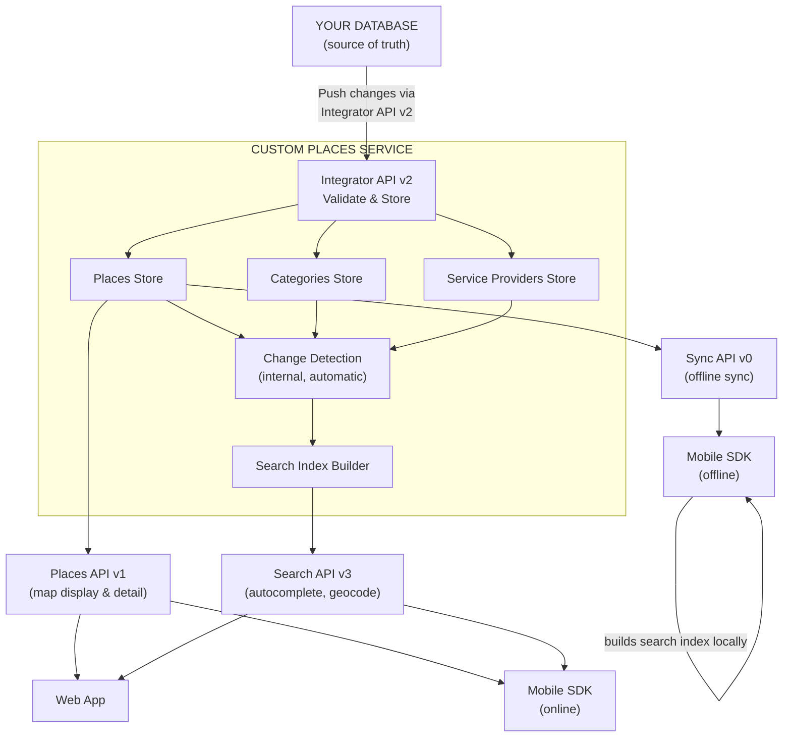
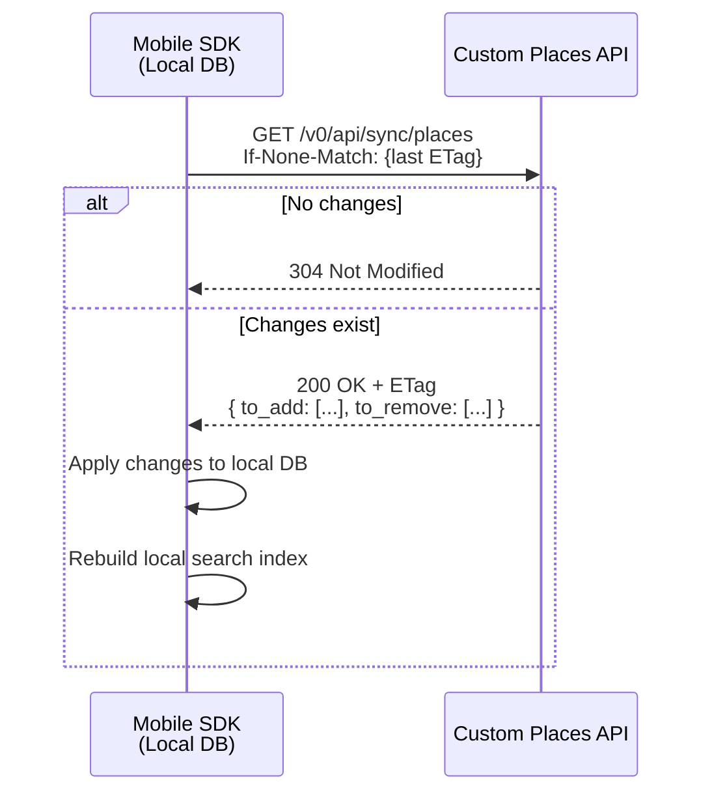
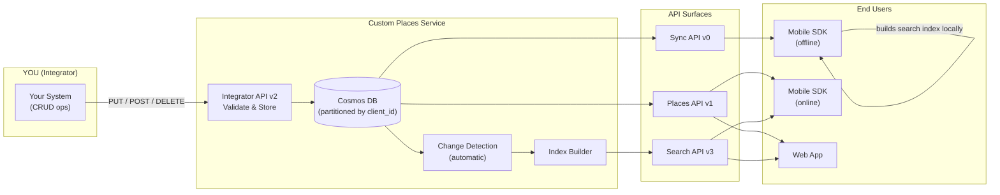

# Custom Places API — Integrator Onboarding Guide

## What is Custom Places?

Custom Places is a data pipeline that lets you — the **integrator** — push your own POI (Point of Interest) data into Sygic's ecosystem. Once ingested, your places become searchable and displayable in:

- **Sygic Mobile SDK** — offline-capable navigation apps
- **Web applications** — browser-based map views and detail pages

**Your database is the source of truth.** This API is a managed data store that you keep in sync with your own systems. You push changes; Sygic's SDKs and web apps consume them.

---

## Architecture Overview

There are **four distinct API surfaces**, each serving a different role in the pipeline:

| API | Base Path | Purpose | Consumer |
|-----|-----------|---------|----------|
| **Integrator API v2** | `/v2/api/integrator/` | Write data (CRUD) | You (the integrator) |
| **Sync API v0** | `/v0/api/sync/` | Pull incremental changes for offline use | Mobile SDK (offline) |
| **Places API v1** | `/v1/api/places/` | Read & filter for map display | Web apps, Mobile SDK (online) |
| **Search API v3** | `/v3/api/` | Autocomplete, geocode, place search | Web apps, Mobile SDK (online) |

### API Spec Links

- Integrator API: [places.api.sygic.com/swagger/v2/integrator.yaml](https://places.api.sygic.com/swagger/v2/integrator.yaml)
- Sync API: [places.api.sygic.com/swagger/v0/sync.yaml](https://places.api.sygic.com/swagger/v0/sync.yaml)
- Places API: [places.api.sygic.com/swagger/v1/places.yaml](https://places.api.sygic.com/swagger/v1/places.yaml)
- Search API: [search.api.sygic.com/swagger/v3/swagger.yaml](https://search.api.sygic.com/swagger/v3/swagger.yaml)

---

## High-Level Data Flow



**You interact with the top (push).** Everything downstream (consumption) happens automatically.

---

## Core Concepts

### Client Identity & Data Isolation

Every piece of data is scoped to your **client ID** (derived from your OAuth credentials). There is no cross-tenant visibility. Two integrators uploading places to the same API will never see each other's data.

### Datasets

Datasets are **optional logical partitions** within your data. Use them to segment places by business unit, region, data source, or any dimension that makes sense for your operations.

- Format: alphanumeric characters, underscores, dots, dashes (`[\w._-]+`)
- Filter by dataset in all read endpoints using pipe-separated values: `?datasets=fleet-A|fleet-B`
- If you don't specify a dataset, a system default is assigned

Datasets are purely organizational — they don't affect how data appears to end users unless the consuming application explicitly filters by them.

### On-Behalf-Of

If your license permits, you can manage data for other client identities. This enables hub-and-spoke models where a parent company manages data for subsidiaries.

- Pass `on_behalf_of` in request body (write) or query param (read)
- Your license must explicitly list which client IDs you can act on behalf of
- Without this permission, attempting `on_behalf_of` returns `403 Forbidden`

---

## The Data Model

You manage three entity types. All are optional except Places (the minimum viable integration). See the [Integrator API spec](https://places.api.sygic.com/swagger/v2/integrator.yaml) for complete field definitions and examples.

- **Places** — A point of interest with location, category reference, localized display names, and search tokens. Optionally extended with EV charger data, vehicle restrictions, opening hours, payment methods, and service provider links.
- **Categories** — Define how places look on the map (icon, color, grouping). A place references exactly one category. Categories support one level of hierarchy via `parent_id` — a child inherits visual properties from its parent unless overridden.
- **Service Providers** — Entities that operate at places (typically EV charging network operators). Managed separately and linked to places by ID, avoiding metadata duplication across stations.

---

## Search: How `display_name` and `search_tokens` Work

The search system is **token-based** with two token types:

- **`index`** tokens — Primary search terms. At least one must match for a result to appear.
- **`refinement`** tokens — Secondary qualifiers. They narrow results but cannot trigger a match alone.

**Example:**
```json
{
  "display_name": [{
    "title": "Slovnaft",
    "subtitle": "Bratska, Petrzalka 85104",
    "lng": "sk",
    "search_tokens": [{
      "index": "Slovnaft cerpacia stanica benzin",
      "refinement": "Bratislava Petrzalka zachod"
    }]
  }]
}
```

- Searching `"Slovnaft"` → **found** (matches index token)
- Searching `"Petrzalka"` → **not found** (refinement alone doesn't match)
- Searching `"Slovnaft Petrzalka"` → **found and refined** (index matches, refinement narrows)

Provide `display_name` entries per language (`lng` field uses RFC 5646 language tags) to support multilingual search.

### Search Priority Scale

| Priority | Meaning |
|----------|---------|
| 13–15 | Internationally known |
| 10–12 | Nationally known |
| 7–9 | Regionally known |
| 4–6 | Known within municipality |
| 1–3 | Known within city district |

Higher priority places surface earlier in search results and appear at wider zoom levels on maps.

---

## Integration Workflow

### Step 1: Upload Categories

Before uploading places, define the categories they'll reference.

```
POST /v2/api/integrator/categories
Authorization: Bearer <token>

{
  "categories": [
    {
      "id": "MyGasStation",
      "dataset": "fuel-network",
      "search_priority": 8,
      "display_name": [
        { "title": "Gas Station", "lng": "en" },
        { "title": "Tankstelle", "lng": "de" }
      ]
    }
  ]
}
```

This is a **full replace** — send the complete collection of categories each time.

### Step 2: Upload Places

```
PUT /v2/api/integrator/places
Authorization: Bearer <token>

{
  "add_or_update": [
    {
      "id": "550e8400-e29b-41d4-a716-446655440000",
      "dataset": "fuel-network",
      "iso": "sk",
      "location": "48.148598,17.107748",
      "category": "MyGasStation",
      "search_priority": 8,
      "display_name": [{
        "title": "Slovnaft Petrzalka",
        "subtitle": "Bratska 12, 85104 Bratislava",
        "lng": "sk",
        "search_tokens": [{
          "index": "Slovnaft cerpacia stanica",
          "refinement": "Petrzalka Bratislava"
        }]
      }],
      "place_data": [
        { "key": "amenities", "values": ["wc", "shop", "car_wash"] }
      ]
    }
  ]
}
```

This is **upsert** — existing places with the same `id` are updated, new IDs are created.

### Step 3: Delete Places (when needed)

```
DELETE /v2/api/integrator/places
Authorization: Bearer <token>

{
  "ids": ["550e8400-e29b-41d4-a716-446655440000"]
}
```

Deletions are soft — the sync API communicates removed IDs to SDK clients so they can clean up locally.

### Step 4: Verify Your Data

Dump your entire dataset to confirm what's stored:

```
GET /v2/api/integrator/places?datasets=fuel-network
Authorization: Bearer <token>
Accept-Encoding: gzip
```

Supports pagination (`next_page`/`prev_page` tokens) and ETag-based caching (`If-None-Match` header returns `304 Not Modified` when data hasn't changed).

> **Note:** This endpoint is intended for occasional verification and sync purposes only. It is not designed for regular polling or as a data-serving layer. Abuse is automatically detected and will result in heavy throttling.

---

## How End Users Consume Your Data

### Mobile SDK — Offline (Sync API v0)

The mobile SDK synchronizes your data for **offline use**:



The sync protocol is **incremental**:

1. First sync: SDK sends no ETag → receives all data in `to_add`
2. Subsequent syncs: SDK sends last ETag via `If-None-Match` header
   - If nothing changed → `304 Not Modified` (no body)
   - If changes exist → response contains `to_add` (new/updated places) and `to_remove` (deleted place IDs)
3. SDK applies changes to local database
4. SDK rebuilds the search index locally from its own DB — no external index download is needed
5. Pagination via `next_page`/`prev_page` tokens — SDK follows these automatically

### Mobile SDK — Online (Places API v1 + Search API v3)

When the device is online, the Mobile SDK can also query data directly without relying on local sync:

- **Places API v1** — fetch places by area, category, or ID for live map display
- **Search API v3** — autocomplete suggestions and geocoding as the user types

This complements the offline flow — the SDK can use whichever path is available.

### Web Applications (Places API v1 + Search API v3)

Web apps use the [Places API v1](https://places.api.sygic.com/swagger/v1/places.yaml) to query places on-demand with geographic, category, dataset, and custom field filters. At least one spatial or category filter is required. Results can also be fetched individually by ID or in batch.

### Search API v3 — Autocomplete & Geocode

The [Search API v3](https://search.api.sygic.com/swagger/v3/swagger.yaml) provides online full-text search over your custom places (and optionally Sygic's map data). It is consumed by both web apps and the Mobile SDK in online mode. It offers autocomplete (type-ahead suggestions), geocode (full search with location/address detail), geocodelocation (resolve an autocomplete suggestion), and getplaces (category-based place lookup within a boundary/radius).

The `mode` parameter is important: set to `MapAndCustomPlaces` (default) to include your custom places alongside Sygic's built-in map POIs. Set to `MapOnly` to exclude custom places.

---

## Data Flow: From Your Push to End-User Display



### What happens when you push data?

1. **You call the Integrator API** — data is validated and stored in Cosmos DB
2. **Change detection fires automatically** — the system detects what changed
3. **Sync endpoints reflect changes** — mobile SDKs pick up changes on next offline sync cycle
4. **Search index is rebuilt** — the Search API v3 (autocomplete, geocode) is updated with your new/modified data
5. **Places API reflects changes** — web apps and mobile SDK (online) see updated data immediately on next query

You don't need to trigger any of steps 2–5. They happen automatically.

---

## Key Design Decisions & Rationale

### Why is your DB the source of truth?

This API is a **projection** of your data, optimized for map display and search. It's not a system of record. If you lose data here, you re-push from your systems. This simplifies conflict resolution — there's no bidirectional sync, no merge logic. You push, the API accepts.

### Why ETags and incremental sync?

Mobile devices have limited bandwidth and storage. The ETag mechanism ensures the SDK only downloads what changed since the last sync. A fleet of 10,000 vehicles syncing every hour would be prohibitively expensive without delta sync.

### Why are `place_data` and `fields` separate?

- **`place_data`** — Opaque key-value pairs passed through to your app. The SDK/API doesn't interpret them. Use for display metadata your app understands (amenities, hours text, image URLs).
- **`fields`** — Server-side indexed filters. The Places API v1 can filter by these. Use for attributes end users might filter on (fuel type, brand tier, availability status).

### Why search tokens vs. just title?

Fulltext search needs more context than a display title. Search tokens let you control:
- What terms trigger discovery (`index`)
- What terms refine/narrow results (`refinement`)
- Per-language search behavior (via `lng` on `display_name`)

This separation prevents pollution — a refinement term like a city name won't match on its own, preventing thousands of irrelevant results when someone searches for "Bratislava".

### Why UUIDs for place IDs?

RFC 4122 UUIDs ensure globally unique, collision-free identifiers across all integrators. Your system generates these — the API never assigns IDs.

---

## Practical Tips

- **Always use `Accept-Encoding: gzip`** — responses can be large, especially bulk dumps
- **Paginate reads** — follow `next_page`/`prev_page` tokens; don't try to fetch everything in one call
- **Use ETags** — send `If-None-Match` on reads to avoid downloading unchanged data
- **Batch your writes** — the PUT endpoint accepts arrays; send multiple places per request instead of one-by-one
- **Validate IDs client-side** — the API enforces RFC 4122 UUID format; invalid IDs are rejected
- **Categories first** — always create/update categories before uploading places that reference them
- **Datasets for organization** — use consistent dataset names across places, categories, and service providers for clean filtering
